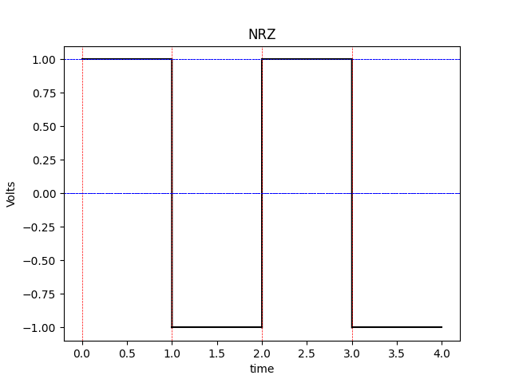
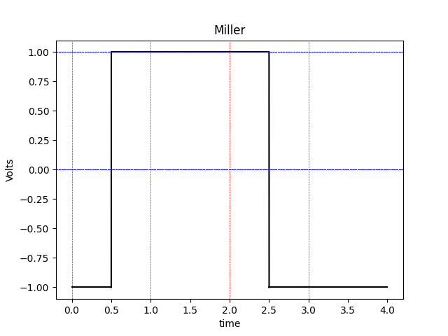

# Rapport TP Réseau (TP1) - La transmission en bande de base.

- UFR ST de l'université du Havre.

---

@Author: Massiles GHERNAOUT.

@Github: [Github Repo.](https://www.github.com/MassiGy)

---


### Sujet

Le but du projet est de pouvoir développer un programme en Java|Python mettant
à disposition une interface graphique qui illustera un signal élécrique. Ce
signal sera le résultat du décodage de la trame binaire saisie par
l'utilisateur ainsi que son encodage.

Les encodages supportés sont ceux vus dans le cours de Réseau en L3, càd: NRZ,
NRZI, Manchester Manchester Différentiel et Miller.

*Note*: L'encodage NRZI n'est pas pris en charge par ce programme, étant donné
que c'est juste l'inverse de NRZ (complément à 1 de la trame binaire).

### Rappel des différents encodage des trames binaires

#### NRZ (No Return to Zero)

Suivant cet encodage, les bits sont représentés dans le signal de la manière suivante:

1: État où le voltage est positif.

0: État où le voltage est négatif.

**Problématique:**

C'est difficile de séparer les succession de plusieurs bits égaux. Toutefois, c'est très simple 
à mettre en place.

#### Manchester 

Suivant cet encodage, les bits sont représentés dans le signal de la manière suivante:

1: Transition durant le cycle de l'horloge d'un état avec un voltage positif vers un voltage négatif.

0: Transition durant le cycle de l'horloge d'un état avec un voltage négatif vers un voltage positif.

Si une succession du même bit apparaît, alors il y aura une transition avant le
cycle de l'horloge (au début) de l'état de voltage actuel vers l'état de voltage
opposé. (un switch de pole)

#### Manchester Différentiel

Suivant cet encodage, les bits sont représentés dans le signal de la manière suivante:

1: Transition durant le cycle de l'horloge.

0: Transition durant le cycle de l'horloge + une transition au début du cycle horloge.

*Note*: La transition au début du temps horloge permet de changer d'état de voltage. 
Positif -> négatif et vice-vers-ça.

#### Miller

Suivant cet encodage, les bits sont représentés dans le signal de la manière suivante:

1: Transition durant le cycle de l'horloge.

0: Absence de transition, sauf si le bit précédent est aussi un 0, alors une transition 
au début du temps horloge est aussi effectuée.

*Note*: La transition au début du temps horloge permet de changer d'état de voltage. 


### Implémentation 

Pour l’implémentation on a décider d'utiliser Python et la librairie Matpotlib, pour le 
dessin du signal.

##### Architecture du projet 

```sh

    .
    ├── doc
    │   ├── CompteRenduTP1.md
    │   ├── idea.txt
    │   ├── notes.txt
    │   └── RESEAUX-TP-Transmission.pdf
    └── src
        ├── decoders
        │   ├── config.py
        │   ├── decoder.py
        │   ├── manchesterDecoder.py
        │   ├── manchesterDiffDecoder.py
        │   ├── millerDecoder.py
        │   ├── nrzDecoder.py
        │   └── utils.py
        └── main.py


```

*`./src`*

Dans la partie `./src` on retrouve un sous dossier `./src/decoders` qui contient un 
fichier `./src/decoders/decoder.py`, dedans on accorde à chaque encodage le bon décodeur
qui sera définie dans l'un des autre fichiers du même dossier, notamment ceux dont le nom
se termine par `*Decoder.py`.

Dans le fichier `./src/decoders/config.py`, on retrouvera toute la configuration relative
au programme, notamment on peut changer les codes d'erreur et de sortie. Aussi, on retrouvera 
quelques autres paramètres relatifs au signal affiché.

Dans le fichier `./src/decoders/utils.py`, on retrouvera quelques fonctions utilitaire pour 
le reste du programme.


Chaque fichier `./src/decoders/*Decoder.py` contient une seule fonction qui décode et dessine 
une trame binaire suivant un encodage unique.


*`./doc`*

Dans la partie `./doc`, on retrouvera le sujet du TP et aussi quelques fichiers de notes, ainsi 
que ce rapport.


### Utilisation

Pour exécuter le programme, veuillez suivre les instruction suivante:

```bash

    # go to the src folder
    cd ./project/src

    # install matpotlib 
    pip3 install matpotlib

    # if pip3 is not installed, run pip as a python module
    python3 -m pip install matpotlib


    # exec with python 
    python3 main.py

```

Le programme vous demandera d'insérer votre trame binaire puis son encodage.

```bash

[ src (master *) ] $ python3 main.py 
Please enter your binary code: 1101
Please enter encoding format (respect case) ['NRZ', 'Manchester', 'Manchester Diff', 'Miller']: Miller

```
Une fois validé, une interface contenant le dessin s'affichera. 


### Résultat des tests

Les tests effectués sont basés sur les exemples du cours/TD, et tout les tests effectués sont passés 
avec succès.


**Exemples de tests:**







### Conclusion

Durant ce projet j'ai pu approfondir ma compréhension des différents types d'encodage des trames 
binaires. Par ailleurs, voilà quelques todo pour la suite: 

* Implémenter le mode OUTPUT_TO_FILE qui permettra de générer et sauvegarder le signal en format
texte vers un fichier.
* Refactorer le code pour respecter le principe DRY (DONT REPEAT YOURSELF).

Par ailleurs, ce projet m'a aider à repérer des trous dans ma compréhension, par exemple: 

* Je ne comprends pas encore les différentes problématiques de chaque encodage qui a poussé au 
fait d'en avoir plusieurs.


